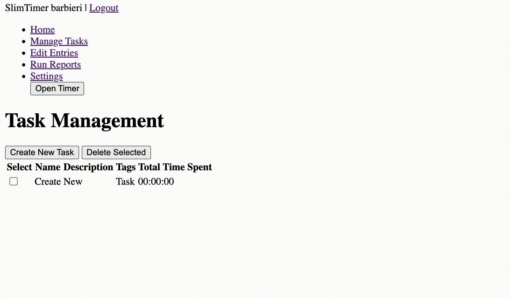

# ThinTimer


## Table of Contents

- [ThinTimer](#thintimer)
  - [Table of Contents](#table-of-contents)
  - [Overview](#overview)
  - [Features](#features)
  - [Screenshots](#screenshots)
  - [Getting Started](#getting-started)
    - [Prerequisites](#prerequisites)
    - [Installation](#installation)
  - [Usage](#usage)
  - [Running the Tests](#running-the-tests)
  - [Contributing](#contributing)
  - [Roadmap](#roadmap)
    - [Testing](#testing)
    - [Documentation](#documentation)
    - [Features](#features-1)
  - [License](#license)
  - [Acknowledgments](#acknowledgments)
  - [Contact](#contact)

---

## Overview

In 2020, Richard White shutdown [SlimTimer](slimtimer.com). At the time, there was chatter that a user would replicate SlimTimer and host it, alas. On September 8th, 2023, I started this project. Using ChatGPT and Richard White's [SlimTimer demo](https://www.youtube.com/watch?v=CeedXS-eZTI), I created *ThinTimer*, a blantant attempt at replicating *SlimTimer*.

---

## Features

- **User Authentication**: Log in securely to manage your tasks. Update your username, passsword, and delete your account.
- **Task Management**: Create, edit, and delete tasks.
- **Time Tracking**: Start and stop timers for individual task entries.
- **Reports**: Generate time reports for any given period (XLSX).

---

## Screenshots

Here's what the application looks like in action:


*Logging in*


*Creating a task*


*Editing a task*


*Creating a task entry*


*Timer window*


*Running a report*


*Deleting your account*

---

## Getting Started

### Prerequisites
- Python 3.9.18
- Django 4.1
- Django Rest Framework 3.14.0

### Installation

1. Clone this repository: `git clone https://github.com/gfbarbieri/thintimer.git`
2. Navigate to the project folder and install dependencies: `pip install -r requirements.txt`
3. Run migrations: `python manage.py migrate`
4. Start the development server: `python manage.py runserver`

---

## Usage

After setting up the development environment, visit `http://localhost:8000/` to start using the app.

- **Creating a Task**: Navigate to the 'Manage Tasks' tab and click on 'Create New Task'.
- **Starting a Timer**: Click on 'Open Timer' an select a task to begin tracking.
- **Generating Reports**: Navigate to the 'Run Reports' tab, specify a date range, export to Excel.

---

## Running the Tests

To execute all tests for all apps:

```
python manage.py test
```

To execute tests for a specific app:

```
python manage.py test <app_name>.tests
```

To execute a specific test class for a specific app run:

```
python manage.py test <app_name>.tests.<class_name>
```

To execute a specific test method in a specific class for a specific app run:

```
python manage.py test <app_name>.tests.<class_name>.<method_name>
```

---

## Contributing

See the [CONTRIBUTING.md](path/to/CONTRIBUTING.md) file for guidelines on how to contribute to this project.

---

## Roadmap

### Testing
- Create tests for CRUD tasks.
- Create tests for CRUD entries.
- Create tests for report generation.

### Documentation
- Create documentation page.
- Create comments for user_auth/tests.py, main_app/tests.py, main_app/serializers.py, main_app/models.py.
- Find the right license to use for the project.
- Get out from under all this JavaScript, I mean Jesus Christ. Or improve the code base, I would take either.

### Features
- Create privacy policy page to ensure users about data storage, access, and usage.
- Create about page to explain the project, funding sources, and maybe something about me and any other future contributors, should they ever exist. Though nowadays, that's what GitHub is for?
- Create more messages, warnings, and other helpful responses on HTML pages to improve user experience.
- Allow users to create new task from the timer or from the edit entry page.
- Implement email login to replace reliance on Django usernames to improve user experience.
- Low priority: CSS and page styling generally. Let someone else design/style the pages.
- Low priority: Develop a public API to allow secure access to ThinTimer user data programatically. I mean why not? In fact, what if the main product is the backend plus API?

---

## License

This project is licensed under the MIT License. See the [LICENSE](LICENSE.md) file for details.

---

## Acknowledgments

- Richard White (and the SlimTimer team?) for the original application and inspiration.
- Guy claiming to re-build SlimTimer, but never did for inspiration.
- ChatGPT, which built the application, as I know nothing about web development.
- Django framework for backend support.

---

## Contact

For more information or queries, contact [gfbarbieri@example.com](mailto:your-email@example.com).
